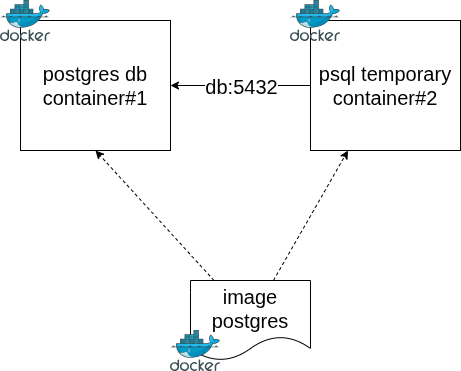
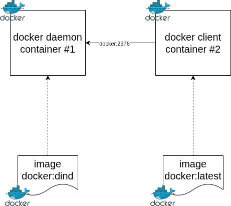
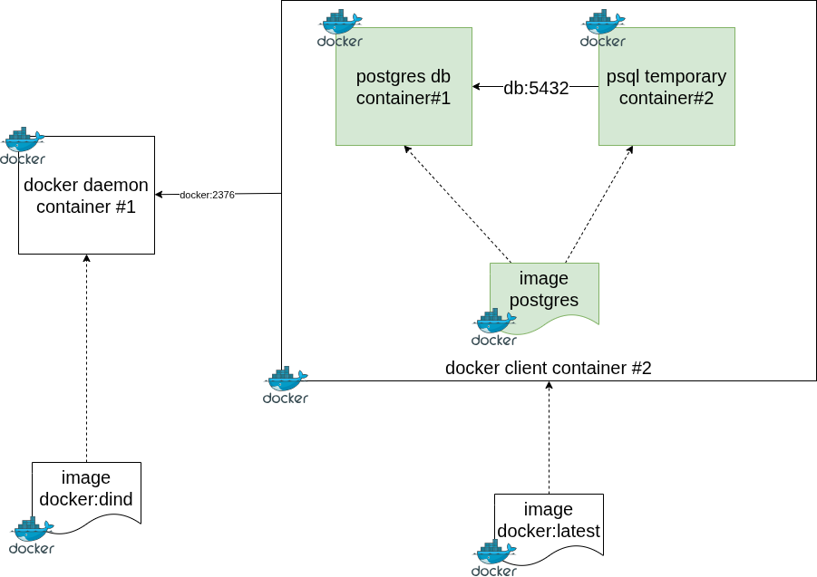
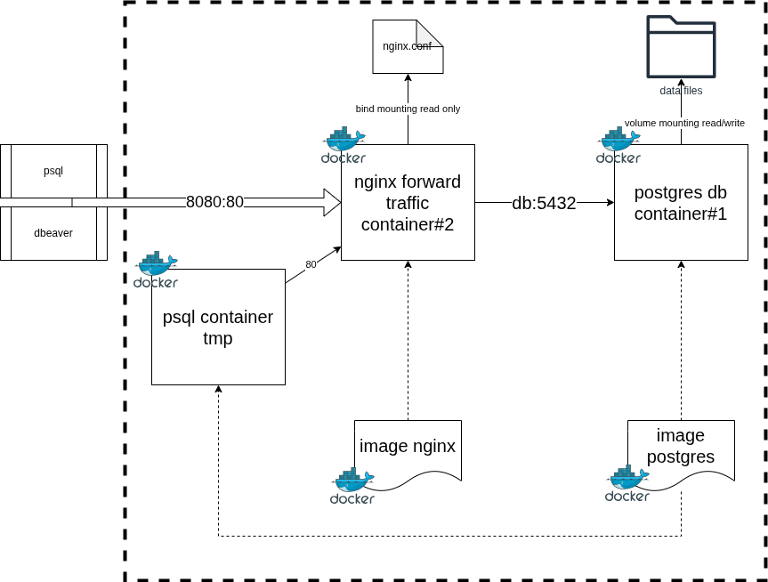

# Docker

## Préparatifs

Utilisation de l'extension `ms-azuretools.vscode-containers` dans Codium.

## Exercice 1 - Conteneur postgres

### Enoncé

Créer un conteneur basé sur l'image Postgres.

Faire en sorte que la connexion avec la base `postgres` soit possible depuis un autre conteneur en utilisant le client `psql` de la même image Postgres.

Le second conteneur doit être temporaire/éphémère. A la fin de l'exécution du processus psql, le conteneur doit être détruit.

L'utilisation de la commande `docker exec` est interdit.

La connexion depuis le second conteneur vers le premier conteneur doit se faire via un alias DNS.



### Solution

Aide : utiliser la commande `docker run` et consulter la [documentation officielle](https://hub.docker.com/_/postgres) de l'image Docker postgres

Pour rappel, la commande `docker run` effectue l'équivalent d'un appel séquentiel à ces 3 commandes

```bash
1. docker pull
2. docker create
3. docker start
```

#### Conteneur 1 - Base de données

Créer le conteneur hébergeant le processus d'instance de postgres

```bash
docker run --name exercice1 -e POSTGRES_PASSWORD=password -d postgres:latest
```

Lister tous les conteneurs actifs

```bash
docker ps
```

Lister tous les conteneurs actifs/inactifs

```bash
docker ps -a
```

Récupérer au format json toutes les infos d'un conteneur spécifique

```bash
docker inspect exercice1
```

Démarrer un second processus dans le conteneur de l'instance pour vérifier que la connexion à l'instance fonctionne localement

```bash
docker exec exercice1 psql -h localhost -U postgres -c "SELECT NOW()"
```

Démarrer également un processus interactif dans le conteneur de l'instance active 

```bash
docker exec -it exercice1 psql -h localhost -U postgres
```

#### Conteneur 2 - Client base de données


Récupérer l'adresse IP de notre base de données démarrée dans le conteneur `exercice1`.

```bash
docker inspect exercice1 --format='{{.NetworkSettings.Networks.bridge.IPAddress}}'
```

```bash
docker run -it --rm postgres psql -h 172.17.0.2 -U postgres
```

Connaître les réseaux auxquels un conteneur est rattaché en passant par la commande inspect

```bash
docker inspect exercice1 --format='{{.NetworkSettings.Networks}}'
```

Créer un réseau personnalisé

```bash
docker network create exercice1_network
```

Associer le conteneur actif à ce réseau

```bash
docker network connect exercice1_network exercice1 --alias db
```

Relancer la commande psql dans un nouveau conteneur cette fois associé à notre nouveau réseau

```bash
docker run -it --rm --network exercice1_network postgres psql -h db -U postgres -c "SELECT NOW()"
```

## Exercice 2 - Dind

### Enoncé

Dind => Docker In Docker

Utiliser l'image `docker:dind` pour créer un conteneur capable de fournir un démon docker à d'autres conteneurs.

Utiliser l'image `docker:latest` pour créer un conteneur faisant office de client pour le démon docker créé précédemment.

Consulter la [documentation officielle](https://hub.docker.com/_/docker) pour plus de détails sur les commandes à utiliser.



Une fois cette architecture en place, utiliser la pour recréer les conteneurs de l'exercice 1.

### Solution

Résultat attendu de la machine hôte

```bash
docker ps
# => 2 containers: daemon and docker client
```

Résultat attendu du client docker

```bash
docker ps
# => 1 container: postgres db and 1 temporary container client db
``` 

#### Conteneur Serveur

Créer un sous-réseau de type bridge

```bash
docker network create dind_network
```

Créer 2 volumes pour stocker les certificats à transmettre à notre client

```bash
docker volume create docker-certs-ca
docker volume create docker-certs-client
```


```bash
docker run --privileged --name dind -d --network dind_network --network-alias docker -e DOCKER_TLS_CERTDIR=/certs -v docker-certs-ca:/certs/ca -v docker-certs-client:/certs/client docker:dind
```


#### Conteneur Client

Pour tester la communication en affichant la version du client et du serveur

```bash
docker run --rm --network dind_network -e DOCKER_TLS_CERTDIR=/certs -e DOCKER_HOST=tcp://docker:2376 -v docker-certs-client:/certs/client:ro docker:latest version
```

Pour vérifier la cohérence avec la version du serveur, exécuter la commande

```bash
docker exec dind docker -v
```

Pour démarrer un processus shell interactif avec le client docker correctement configuré

```bash
docker run -it --rm --network dind_network -e DOCKER_TLS_CERTDIR=/certs -e DOCKER_HOST=tcp://docker:2376 -v docker-certs-client:/certs/client:ro docker:latest sh
```

Pour retrouver un exemple de cas d'utilisation, voir l'[installation de Jenkins avec Docker](https://www.jenkins.io/doc/book/installing/docker/).

Rajouter en tant que variable d'environnement

```bash
export DOCKER_TLS_VERIFY=1
export DOCKER_CERT_PATH=/certs/client
```

Tester le lancement d'un processus interactif

```bash
docker exec -it awesome_yalow sh
```

Visualiser la liste des conteneurs actifs dans ce nouveau contexte

```bash
docker ps
```


Résumé de l'architecture



## Exercice 3 - Redirection avec Nginx

### Enoncé



Pour configurer le serveur nginx avec une redirection type stream, voir la [documentation officielle](https://nginx.org/en/docs/stream/ngx_stream_core_module.html).

En résumé, cela revient à configurer le serveur avec le bloc de code suivant :

```
stream {

    upstream database {
       server db_host_ip_name:db_port;
    }

    server {
        listen nginx_listening_port;
        proxy_connect_timeout 1s;
        proxy_timeout 3s;
        proxy_pass database;
    }
}
```

Contraintes :

* utiliser un bind mounting pour la configuration nginx
* uitiliser un volume mounting pour les données de la base de données postgres

### Solution

Aide : préparer la [configuration nginx](https://hub.docker.com/_/nginx#customize-configuration) en amont et utiliser le bind-mounting

Etapes à suivre

1. Créer un sous-réseau `exercice3_network` de type `bridge`

```bash
docker network create exercice3_network
```

2. Créer un volume nommé `pgdata` destiné à sauvegarder l'état des fichiers sur disque de la base de données

```bash
docker volume create pgdata
```

3. Créer le conteneur de base de données `postgres` utilisant le volume nommé `pgdata` avec l'alias DNS `db`.

```bash
docker run --name postgres --network exercice3_network --network-alias db -v pgdata:/var/lib/postgresql/18/docker -e POSTGRES_PASSWORD=password -d postgres:latest
```


4. Récupérer la configuration initiale du serveur nginx

```bash
docker run --rm --entrypoint=cat nginx:latest /etc/nginx/nginx.conf > ./exercice3/nginx.conf
```

Pour vérifier le port d'écoute déjà configuré, démarrer un shell en interactif

```bash
docker run --rm -it --entrypoint=bash nginx:latest
```

Alternative si l'entrypoint n'a pas été défini au niveau de l'image

```bash
docker run --rm -it nginx:latest bash
```


5. Modifier cette configuration pour ajouter le support du streaming

Ajouter la configuration suivante au fichier nginx.conf

```
stream {

    # green
    upstream database {
       server db:5432;
    }

    # purple
    server {
        listen 80;
        proxy_connect_timeout 1s;
        proxy_timeout 3s;
        proxy_pass database;
    }
}
```


6. Créer le conteneur `nginx` avec le bind-mounting activé sur le fichier `nginx.conf` avec l'alias DNS `front`

```bash
docker run --name front --network exercice3_network --network-alias front -p 8080:80 -v ./exercice3/nginx.conf:/etc/nginx/nginx.conf:ro -d nginx:latest
```

7. Créer le conteneur temporaire client de base de données `psql`

```bash
docker run --rm -it --network exercice3_network postgres:latest psql -h front -p 80 -U postgres
```


#### Tests

Vérifier le bon fonctionnement du volume pgdata.

Se connecter à l'instance postgres avec le client psql local

```bash
docker exec -it -u postgres postgres psql
```

Créer une table et insérer une ligne

```sql
create table test_volume(id serial primary key, created_at timestamp default now());
insert into test_volume default values;
select * from test_volume;
```

Supprimer le conteneur

```bash
docker stop postgres
docker rm postgres
```

Recréer le conteneur avec le même volume


```bash
docker run --name postgres --network exercice3_network --network-alias db -v pgdata:/var/lib/postgresql/18/docker -d postgres:latest
```

Vérifier que la table est toujours présente avec la ligne de données


```bash
docker exec -it -u postgres postgres psql
```

```sql
select * from test_volume;
```

Vérifier que le fichier nginx.conf est bien pris en compte par le processus nginx dans le nouveau conteneur

```bash
docker exec front cat /etc/nginx/nginx.conf
```

Une fois les tests terminés, supprimer les conteneurs, les volumes et les réseaux.


```bash
docker stop postgres front
docker rm postgres front
docker volume rm pgdata
docker network rm exercice3_network
```

## Exercice 4 - Conversion en Compose

### Enoncé

Reprendre les ressources créées dans l'exercice 3 et encapsuler le tout dans un fichier `compose.yaml`.

Vous pouvez vous aider de la documentation officielle de [docker compose](https://docs.docker.com/reference/compose-file/).

### Solution

Voir le fichier [compose.yaml](./exercice4/compose.yaml)

Appliquer le fichier `compose.yaml` avec la commande

```bash
docker compose up -d
```

Détruire l'ensemble des ressources, y compris les volumes avec la commande

```bash
docker compose down --volumes
```

Tester la connexion depuis un conteneur rattaché au sous-réseau de docker compose

```bash
docker run --rm -it --network exercice4_exercice4_network postgres:latest psql -h front -p 80 -U postgres
```